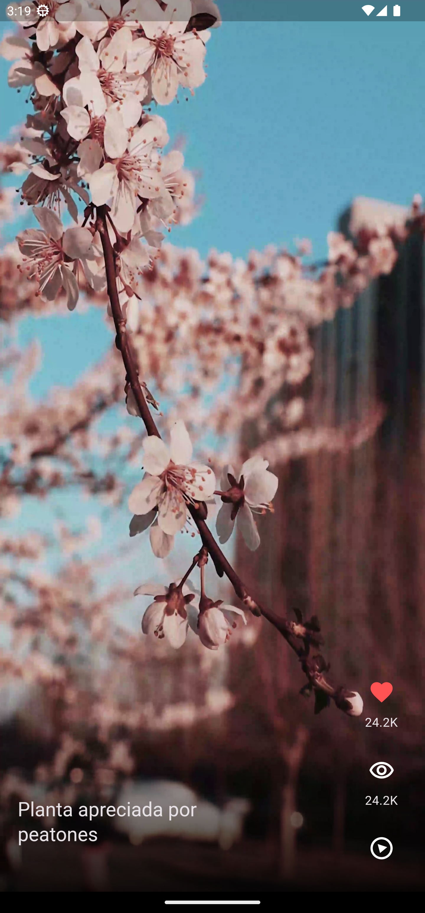

# Tik Tok (clone) applicacion

This application displays videos similar to Tik Tok.

## Android platform overview

- Minimum supported version: Android version 5.0 Lollipop (Api level 21)
- Application Identifier (applicationId) **com.example.flutter_video_app**

## Get Started 🚀

- Depending on the platform (Windows / MacOS) install Flutter in the stable version `3.10.0`
- In case of using different versions of Flutter, it is recommended to install and use the Flutter [FVM version manager](https://fvm.app/).

```
git clone https://github.com/baguilar6174/flutter-yesNoChat-app.git
```

- Run `flutter pub get` in project root
- Run `flutter run`

## Packages used

* `provider: ^6.0.5` State management
* `intl: ^0.18.1`
* `animate_do: ^3.0.2` Widgets animations
* `video_player: ^2.6.1` Video player 

## What I learned

- Assets management
- Gesture Detector
- Widgets Positoned
- Mappers
- Gradients
- Loops
- Stacks
- Video controllers

## Tik Tok (clone) applicacion

<table>
  <tr>
    <td align="center" valign="center"></td>
    <td align="center" valign="center"></td>
  </tr>
</table>


## Stay in touch

- Website - [www.bryan-aguilar.com](https://www.bryan-aguilar.com/)
- Medium - [baguilar6174](https://baguilar6174.medium.com/)
- LinkedIn - [baguilar6174](https://www.linkedin.com/in/baguilar6174)
